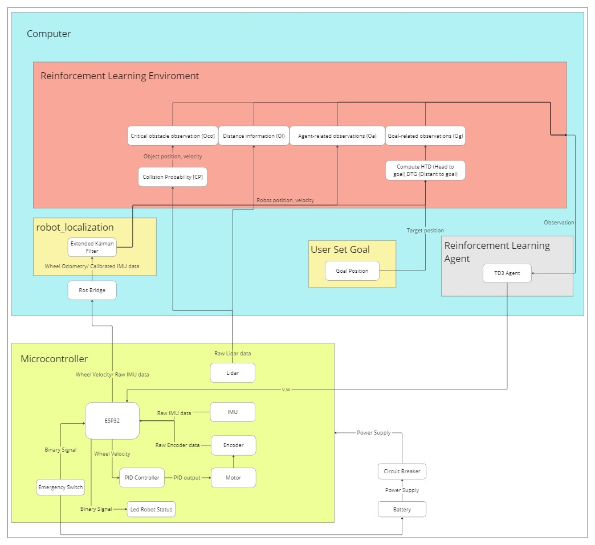
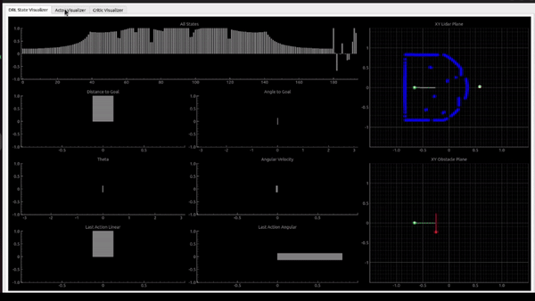

# Carver-Savvy : Deep Learning-based Navigation for Mobile Robots in Dynamic Environments

## A ROS2 Project for DRL autonomous navigation on mobile robots with LiDAR.

<p float="left">
 
</p>

# **Table of contents**
* [Introduction](#introduction)
* [Installation](#installation)
* [Running the Project](#running-the-project)
  * [Training the Agent](#training-the-agent)
  * [Optional Configuration](#optional-configuration)
  * [Utilities](#utilities)
* [Physical Robot](#physical-robot)

# **Introduction**

This repository provides a ROS2 and PyTorch framework designed for developing and experimenting with deep reinforcement learning for autonomous navigation in mobile robots. The models are trained in simulation and evaluated in both simulated and real-world environments. The project utilizes the Carver-savvy, a differential drive mobile robot equipped with essential sensors such as a 2D lidar, IMU, and encoders. The reinforcement learning agent is trained in a simulation environment using ROS2 Gazebo. Nevertheless, the framework is flexible and can be adapted to any robot model that provides LiDAR and odometry information and can operate with linear/angular velocity messages.

The applications enabled by the current framework:

* Train, save, load, and assess a navigation agent within varied simulated environments.
* Implement a pre-existing model onto an actual robot for navigation and obstacle avoidance.
* Analyze the impact of various hyperparameters on training duration and performance.
* Develop custom Deep Reinforcement Learning (DRL) algorithm options [Algorithim in this repo: TD3, SAC.]
* Micro-ros integration for real-time communication with the robot.
* Kalman filter for sensor fusion and odometry correction using robot_localization package.
* ROS2 Navigation for testing robot navigation in real-world environments.

# **Installation**

## **Dependencies**

*   Ubuntu 22.04 LTS (Jammy Jellyfish) [link](https://releases.ubuntu.com/jammy/)
*   ROS 2 Humble Hawksbill [link](https://docs.ros.org/en/humble/Installation.html)
*   Gazebo (Version: 11.10.2) [link](https://gazebosim.org/docs)
*   PyTorch (Version: 2.3.0) [link](https://pytorch.org/)

## **Installing ROS2**
Install ROS 2 Humble according to the following guide: [link](https://docs.ros.org/en/humble/Installation/Ubuntu-Install-Debians.html). Recommended installation is the desktop version (ROS, RViz, demos, tutorials). <br>
To prevent having to manually source the setup script every time, add the following line at the end of your `~/.bashrc` file:

```
# Replace ".bash" with your shell if you're not using bash
# Possible values are: setup.bash, setup.sh, setup.zsh
source /opt/ros/humble/setup.bash
```

## **Installing Python3, Pytorch**

The last tested version for this project was Python 3.10.12

Install pip3 (python package manager for python 3) as follows:
```bash
sudo apt install python3-pip
```

To install the tested version of PyTorch (2.3.0) with CUDA support, run the following command:
```bash
pip3 install torch torchvision torchaudio
```

or without CUDA support:
```bash
pip3 install torch torchvision torchaudio --index-url https://download.pytorch.org/whl/cpu
```

To install the `pyqtgraph` and `PyQt` with is optional and only necessary if you want to visualize the neural network activity. 

```bash
pip3 install pyqtgraph PyQt5
```

**Note: The version of CUDA support to install will depend on the [compute capability](https://developer.nvidia.com/cuda-gpus) of your GPU**

## **Enabling GPU support (recommended)**

We can significantly speed up the training procedure by making use of a GPU. If no GPU is available or it is not initialized correctly the training will automatically be redirected to the CPU. Since most users have access to an NVIDIA GPU we will explain how to enable this to work with PyTorch on linux.
Three different components are required to train on GPU:
- NVIDIA drivers for linux
- The CUDA library for linux
- cuDNN (comes with pytorch and should be installed automatically)

Press the windows/command key and type "Additional drivers" to make the corresponding linux menu come up. Here, multiple radio button options should be listed for installing different nvidia drivers. Install the option with the latest version (highest number, e.g. currently nvidia-driver-510).

The next step is to download the correct CUDA version. This will depend on your NVIDIA drivers and GPU variant. Following [link](https://developer.nvidia.com/cuda-downloads?target_os=Linux&target_arch=x86_64&Distribution=Ubuntu&target_version=22.04&target_type=deb_local) will take you to the CUDA download page. Follow the instructions to download the correct version for your system.

You can then verify that CUDA is installed using:

```bash
nvidia-smi
```

Which should display version numbers and GPU information. If you see this, you are enabled to train on the GPU.

Example output:
```
+-----------------------------------------------------------------------------+
| NVIDIA-SMI 535.171.04    Driver Version: 535.171.04    CUDA Version: 12.2   |
|-------------------------------+----------------------+----------------------+
| GPU  Name        Persistence-M| Bus-Id        Disp.A | Volatile Uncorr. ECC |
| Fan  Temp  Perf  Pwr:Usage/Cap|         Memory-Usage | GPU-Util  Compute M. |
|                               |                      |               MIG M. |
|===============================+======================+======================|
|   0  GeForce RTX 3060    Off  | 00000000:01:00.0 Off |                  N/A |
|  0%   41C    P8    15W / 350W |      0MiB / 24268MiB |      0%      Default |
|                               |                      |                  N/A |
+-------------------------------+----------------------+----------------------+
```

## **Downloading the Repository**

Open a terminal in the desired location for the new workspace. Clone the repository using:
```bash
git clone https://github.com/AthimetA/CARVER-Savvy.git
```

`cd` into the directory and make sure you are on the main branch
```bash
cd CARVER-Savvy/
git checkout main
```

Next, the ros2 dependencies by running (this will install all the necessary dependencies for the project):
```bash
source install.bash
```

Next, Build the workspace using colcon:
```bash
# If you are in the CARVER-Savvy directory
cd carverabwu/
# Build the workspace using colcon
# Always build with --symlink-install to avoid having to rebuild the workspace after every change
colcon build --symlink-install
```
After colcon has finished building source the repository using: 
```bash
source install/setup.bash
```

or add the following line to your `~/.bashrc` file (if the repository is in your home directory):
```bash
source ~/CARVER-Savvy/carverabwu/install/setup.bash
```

The last thing we need to do before running the code is add a few lines to our `~/.bashrc` file so that they are automatically executed whenever we open a new terminal. Add the following lines at the end of your `~/.bashrc` file and **replace the path to the workspace with the path to your workspace**:

```bash
# ROS2 domain id for network communication, machines with the same ID will receive each others' messages
export ROS_DOMAIN_ID=1

WORKSPACE_DIR=~/CARVER-Savvy/carverabwu
export ABWUDRL_BASE_PATH=$WORKSPACE_DIR

# Model path for Gazebo
export SIM_MODEL_PATH=$WORKSPACE_DIR/src/abwu_gazebo/models/

#Allow gazebo to find models
export GAZEBO_MODEL_PATH=$GAZEBO_MODEL_PATH:$WORKSPACE_DIR/src/abwu_gazebo/models

```

**Note: Always make sure to first run ```source install/setup.bash``` or open a fresh terminal after building with `colcon build`.**


# **Running the Project**

System architecture of the project is shown below:

<p float="left">
 
</p>

The project is divided into three main components: the reinforcement learning agent, the reinforcement learning environment, and the robot. 
* The agent is responsible for learning the optimal policy for navigating the robot in the environment. 
* The environment is responsible for providing the agent with the necessary information to learn the policy. In training, the environment is simulated in Gazebo and the micro-ros node is used to communicate with the robot. In testing, the environment is the real world and the robot is controlled by the agent.
* The robot is responsible for executing the policy learned by the agent in the environment. In training, the robot is simulated in Gazebo and the micro-ros node is used to communicate with the environment. In testing, the robot is the physical robot.

## **Training the Agent**

To train the agent, we need to run the following commands in separate terminals:

1. Start the Gazebo simulation:
```bash
# The stage number can be changed to choose a different stage
ros2 launch awbu_drl abwu_drl_stage_5.launch
```

2. Start the reinforcement environment:
```bash
ros2 launch awbu_drl abwu_drl_env.launch
```

Note: the obstacle collision probability calculation node in simulation better be running using drl_obstacle_cp.py script for better detection of obstacles. for the real obstacle collision probability calculation, the detection of obstacles is done using the lidar data and the velocity of the obstacles is calculated using the kalman filter. 

Your can change the obstacle detection and velocity calculation method by changing the `drl_obstacle_cp` node in the `abwu_drl_env.launch.py` file.

```python

    drl_obstacle_cp = Node(
            package='awbu_drl',
            executable='drl_obstacle_cp_real.py', # change to drl_obstacle_cp.py for simulation
            name='drl_obstacle_cp',
            parameters=[{'use_sim_time': use_sim_time}],
         )

``` 

Note: By using drl_obstacle_cp_real.py script, the Evaluation matrix is calculation is <b>not implemented</b> yet.

3. Start the reinforcement learning agent:

When no arguments are provided, the agent will run in the default mode. The default mode is agent = 'td3' and mode = 'train'. The agent will start training and the training progress will be displayed in the terminal. 

```bash
ros2 run awbu_drl drl_agent
```

for Optinal mode, you can run the agent with the following command:

TD3:

```bash
ros2 run awbu_drl drl_agent td3
```
SAC:

```bash
ros2 run awbu_drl drl_agent sac
```

Training and Testing, can be run with following command:
```bash
ros2 run awbu_drl drl_agent td3 train
```
```bash
ros2 run awbu_drl drl_agent td3 test
```

## **Optional Configuration**

### Settings: change parameters

The `settings/constparams.py` file contains most of the interesting parameters that you might wish to change, including the DRL hyperparameters.

### Reward: tweak reward design

The `drlutils_reward.py` file contains the reward design. You can change the reward function to improve the agent's performance.

### Map and Obstacle: change the map and obstacle design

You can change the map and obstacle design by editing the `abwu_gazebo/maps` and `abwu_gazebo/models` directories.

the `abwu_gazebo/maps` directory contains the map files that define the environment. The map files are in the `.world` format and can be edited using Gazebo.

the `abwu_gazebo/models` directory contains the obstacle models that are placed in the environment. The obstacle models are in the `.sdf` format and can be edited using Gazebo.

for dynamic goal, the goal position can be changed by editing the model file in the `abwu_gazebo/models` directory.

When edit Physic in Gazebo, if you want to run the simulation in real-time (x1) or faster (x2) you can change in the world file as shown below:

```yaml
    <physics type="ode">

      <!-- Physics Rule 
      
      1. max_step_size: 
          The maximum time step size that can be taken by a variable time-step solver (such as simbody) during simulation. 
          For physics engines with fixed-step solvers (like ODE), this is simply the time step size. 
          The default value in Gazebo is 0.001 seconds.
      2. real_time_update_rate: 
          This is the frequency at which the simulation time steps are advanced. 
          The default value in Gazebo is 1000 Hz. Multiplying with the default max_step_size of 0.001 seconds gives a real_time_factor of 1.
          If real_time_update_rate is set to 0 the simulation will run as fast as it can. 
          If Gazebo is not able to update at the desired rate, it will update as fast as it can, based on the computing power.
      3. real_time_factor:
          max_step_size x real_time_update_rate sets an upper bound of real_time_factor. 
          If real_time_factor < 1 the simulation is slower than real time.
          real_time_factor = 1 means the simulation runs in real-time.
          real_time_factor = 2 means the simulation runs twice as fast as real-time.

      [real_time_factor = max_step_size * real_time_update_rate]
      
      -->
      <!-- Physics x1 realtime-->
      <max_step_size>0.001</max_step_size>
      <real_time_update_rate>1000.0</real_time_update_rate>
      <real_time_factor>1</real_time_factor>

      <!-- Physics x2 realtime-->
      <!-- <max_step_size>0.002</max_step_size> 
      <real_time_update_rate>1000.0</real_time_update_rate>
      <real_time_factor>2</real_time_factor>  -->

      <ode>
        <solver>
          <type>quick</type>
          <iters>150</iters>
          <precon_iters>0</precon_iters>
          <sor>1.400000</sor>
          <use_dynamic_moi_rescaling>1</use_dynamic_moi_rescaling>
        </solver>
        <constraints>
          <cfm>0.00001</cfm>
          <erp>0.2</erp>
          <contact_max_correcting_vel>2000.000000</contact_max_correcting_vel>
          <contact_surface_layer>0.01000</contact_surface_layer>
        </constraints>
      </ode>
    </physics>
```

Note: when edit real_time_update_rate, the controller parameters config file should be changed to the same value as the real_time_update_rate in the world file. You can edit at `carversavvy_description/config/carversavvy_controller.yaml` file.

```
controller_manager:
  ros__parameters:

    use_sim_time: true
    
    # x1 Simulator
    update_rate: 1000 # Hz

    # x2 Simulator
    # update_rate: 500 # Hz

    joint_state_broadcaster:
      type: joint_state_broadcaster/JointStateBroadcaster
    
    velocity_cont:
      type: velocity_controllers/JointGroupVelocityController

```

## **Utilities**

### Visualization: visualize the neural network activity

The `drlutils_visualization.py` file contains the code for visualizing the neural network activity. You can edit this file to visualize the neural network activity or any other information you wish to visualize.

<p float="left">
 
</p>